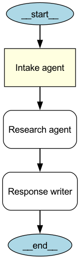

# Chapter 10 Lab 11: Visualize a Multi-Agent Handoff Architecture

This lab creates a static, three-agent chain using real Agents SDK `Agent`
objects and two directed handovers. The SDK visualization extension turns the
root agent's handoff graph into a PNG. The diagram build does not call the model
and does not require `OPENAI_API_KEY`.

## Prerequisites

The Python package's `viz` extra installs the Graphviz Python binding. Rendering
also needs the Graphviz `dot` executable:

```bash
# macOS
brew install graphviz

# Debian or Ubuntu
sudo apt-get update && sudo apt-get install graphviz
```

## Install and export

From this directory:

```bash
uv venv
uv pip install -r requirements.txt
./.venv/bin/python export_diagram.py
```

The default output is `outputs/multi-agent-handoffs.png`. Choose another PNG
path with:

```bash
./.venv/bin/python export_diagram.py --output /tmp/support-handoffs.png
```

The exporter calls `draw_graph(build_architecture(), filename=...)`; Graphviz
renders the graph and writes the PNG.

## Architecture

```text
Intake agent ──handoff 1──▶ Research agent ──handoff 2──▶ Response writer
```



Each handoff is real SDK `Agent.handoffs` configuration. The writer ends the
chain. See `architecture.py` for the three agent definitions.

## Offline tests

```bash
./.venv/bin/python -m pytest -q
```

The tests check the SDK objects and both edges. The image-render test skips if
the native Graphviz executable is unavailable; install it using the commands
above to verify the PNG signature too.
