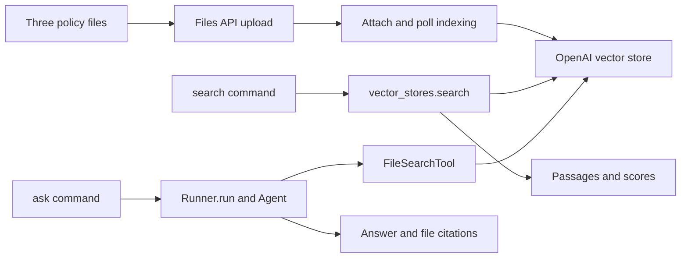

# Lab 07 — Build a document knowledge assistant

Allow 35–45 minutes after [setup](README.md#setup). Use the same Python
environment and run the commands from this solution directory.

## 1. Understand the two retrieval paths

OpenAI indexes the three uploaded Markdown files. Direct search helps you
inspect the knowledge base before asking a model to use it.



The Files API object stores the upload. A `vector_store.file` associates it with
a store and its index. OpenAI handles parsing, chunking, and embeddings when
the file is added. You do not need a separate embedding model call or a local
vector database. See the official [retrieval guide](https://developers.openai.com/api/docs/guides/retrieval).

## 2. Upload once and wait for indexing

Read `data/*.md`, then run:

```bash
python run_reference.py ingest
```

Expect one `vs_...` ID, three uploaded file IDs, a completed message for each
file, and a final `Ready` message. Open `.vector-store-state.json`: it should
have `ready: true` and all three file IDs. Do not commit or edit this file.

In `store.py`, locate `files.create` and
`vector_stores.files.create_and_poll`. A successful upload alone does not mean
the document is searchable. The poll helper can return `failed` or `cancelled`,
so the implementation checks `indexed.status == "completed"`. The lab bounds
each indexing wait at 120 seconds and retains partial state on failure.

Each indexed file has a `category` attribute derived from its filename:
`delivery`, `returns`, or `support`. The ready store is reused by subsequent
commands; starting an agent run does not create another store.

## 3. Inspect retrieval without generating an answer

```bash
python run_reference.py search "Can I return unopened coffee after 10 days?"
```

Find the returns policy passage about 14 calendar days, unopened shelf-stable
products, and proof of purchase. The output includes the filename, file ID,
retrieval score, and text. Scores rank retrieved passages; they are not
probabilities that a generated answer is correct. This command calls the
Retrieval API, not `Runner.run`.

Try an attribute filter:

```bash
python run_reference.py search "coffee returns" --category returns
python run_reference.py search "coffee returns" --category delivery
```

The first command should retrieve returns material. The second is restricted
to delivery material and may return irrelevant passages or no matches. A
restrictive filter can remove the evidence required to answer a question.

## 4. Give the store to a real SDK agent

Read `build_agent()` in `run_reference.py`. Its core tool configuration is:

```python
FileSearchTool(
    vector_store_ids=[vector_store_id],
    max_num_results=max_results,
    include_search_results=True,
    filters=category_filter(category),
)
```

`Agent` holds the instructions and tool. `ModelSettings(tool_choice="required")`
requires a tool call; this lab supplies only file search. `Runner.run` executes
the agent. The model chooses its search queries and writes the answer from
retrieved evidence. The direct-search output from step 3 is not manually
inserted into the agent's prompt.

```bash
python run_reference.py ask "Can I return unopened coffee after 10 days, and when do next-day orders close?"
```

Check for these facts, allowing different wording:

- The coffee qualifies if it is unopened and proof of purchase is available;
  the returns window is 14 calendar days from delivery.
- Next-day delivery orders must be placed before 18:00 Europe/Berlin;
  delivery operates Monday through Saturday.

The answer needs evidence from both `returns.md` and `delivery.md`. Inspect
the printed search queries and passages. Then check the actual file citation
annotations against the claims. A filename in generated prose is not itself
a citation annotation, and a citation alone does not prove the claim is correct.

`include_search_results=True` exposes retrieved results on returned
`file_search_call` items; without it, citations can still appear but those
results are not returned by default. The printer reads `result.new_items`
and extracts file citations from assistant message annotations.
See the [file search guide](https://developers.openai.com/api/docs/guides/tools-file-search).

## 5. Try missing evidence and retrieval limits

```bash
python run_reference.py ask "What was Northstar Market's annual revenue?"
python run_reference.py ask "What are the support hours and next-day delivery cutoff?" --max-results 1
python run_reference.py ask "What are the support hours and next-day delivery cutoff?" --max-results 3
python run_reference.py ask "What are the support hours?" --category returns
```

The documents contain no revenue figure, so expect the agent to acknowledge
missing information. Support hours are Monday–Friday, 09:00–18:00 Europe/Berlin;
the delivery cutoff is before 18:00. Compare the evidence and answers with one
versus three results. This is a per-search result limit, not a guaranteed number
of distinct source files or a cap on all searches in the run. The final command
restricts retrieval to returns, so support hours are unavailable in that scope.

If the agent invents unsupported information, record it as a failed manual
check and inspect the instructions and tool results. The instruction to admit
missing evidence is a behavioral expectation, not a deterministic guarantee.

## 6. Inspect usage and tracing

`RunConfig` sets `workflow_name="lab-07-vector-store"` and lab metadata. With
tracing enabled and available to your project, find the run in the OpenAI trace
viewer. `trace_include_sensitive_data=False` excludes sensitive generation
payloads from traces; document upload, retrieval, and the model run still send
data to OpenAI. The console deliberately shows the fictional retrieved text.

Token counts come from `result.context_wrapper.usage`. They are useful for
comparing runs but do not include a complete storage or hosted-tool bill.
The lab prints no estimated dollar total.

## 7. Clean up the lab

```bash
python run_reference.py cleanup
```

Expect deletion of one store and three uploaded files, then removal of the
manifest. Store deletion and Files API deletion are separate operations.
Cleanup targets only recorded IDs and handles resources already removed or
expired. If it fails, rerun it using the same manifest; completed deletions have
already been recorded. Do not delete the manifest to fix an ingestion error.

The store also has a one-day inactivity expiration policy. Expiration removes
the store's indexed associations; it does not replace deleting the original
Files API uploads. See [expiration policies](https://developers.openai.com/api/docs/guides/retrieval#expiration-policies).

## Troubleshooting

| Symptom | Action |
|---|---|
| Command prints `SKIP` | Supply a nonblank `OPENAI_API_KEY` to this shell. No live work occurred. |
| Authentication or permission error | Check the key and API project's access. API error bodies are suppressed because they can contain credential fragments. |
| Model unavailable or incompatible | Confirm your API project can access `gpt-6-luna`, which supports Responses file search. |
| Manifest already exists | Reuse it for search/ask, or run cleanup before a fresh ingest. |
| Indexing fails, times out, or state is incomplete | Use the retained manifest to clean up, then retry ingest. |
| Store expired or was removed | Run cleanup to remove remaining uploads, then ingest again. |
| Cleanup fails | Keep the manifest, fix connectivity/access, and retry with the same `--state` path. |
| Manifest was lost or a create response was interrupted | Check the printed IDs and the lab-named store in the OpenAI dashboard; remove only this lab's resources manually. A local manifest cannot record a resource whose creation response never arrived. |
| Results lack needed evidence | Inspect the source files and category filter, then compare result limits. |

## Acceptance checklist

- [ ] All three documents finish indexing and the same store is reused.
- [ ] Direct search returns the expected policy passage.
- [ ] The agent uses hosted file search and answers the two-document question.
- [ ] Citation annotations point to files supporting the answer.
- [ ] The revenue question produces an explicit acknowledgement of missing evidence.
- [ ] Filters and result limits visibly change retrieval scope.
- [ ] Cleanup removes both the store and original uploads.
- [ ] Offline tests pass; any live verification is recorded separately.
